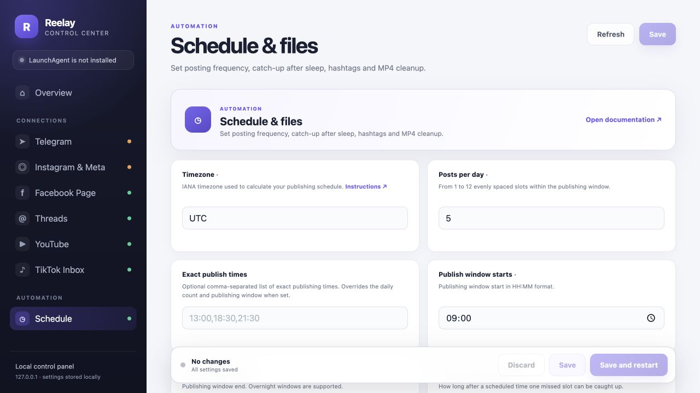
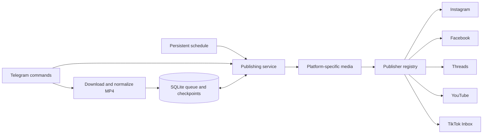

# Reelay

[](https://github.com/pol4xer/Reelay/actions/workflows/ci.yml)

**A self-hosted Telegram queue for scheduled short-form video publishing.**

Send an Instagram video link to your bot, add a caption, and let Reelay prepare the MP4 and
publish it on your schedule. Instagram Reels is the primary destination; Facebook Reels,
Threads, YouTube, and TikTok Inbox can be enabled independently.

Built with **Python 3.13**, **asyncio**, **python-telegram-bot**, **SQLite**, **FFmpeg**, and
**yt-dlp**. Runs on macOS or in a Linux Docker container. This repository contains the application
and its deployment tooling; each operator supplies their own accounts and credentials.



*Local settings panel with example configuration and an empty queue. No account credentials are shown.*

## Reference channels

Public channels associated with this project:

- [Instagram](https://www.instagram.com/rbc_haze_harris/)
- [YouTube](https://www.youtube.com/channel/UCyvzAoRPo7TaVB8N7LJkIJA)
- [TikTok](https://www.tiktok.com/@rbc_haze_harris)
- [Facebook](https://www.facebook.com/profile.php?id=61572320376278)
- [Threads](https://www.threads.com/@rbc_haze_harris)

## What it does

- **Telegram as the control surface:** add links and captions, inspect the queue, retrieve an MP4,
  publish the next item, pause, resume, or retry a failed job.
- **Persistent scheduling:** choose 1–12 exact daily times or distribute posts across a time
  window. Schedule changes survive restarts; missed slots have a bounded catch-up window.
- **Video preparation:** preserve the full frame on a 1080×1920 blurred canvas for non-vertical
  videos, generate hashtags, and optionally cache a subtle Reelay watermark.
- **Independent publishing:** attempt every enabled destination, preserve successful platform
  IDs, and report partial failures together. Retries skip destinations with saved completion IDs.
- **Local settings panel:** configure accounts and scheduling in a browser, with write-only
  credential fields and atomic `.env` updates.
- **Operational tooling:** process locks, queue audits, macOS LaunchAgent management, and a
  non-root Docker image with persistent data and rotated logs.

| Destination | Reelay's delivery behavior |
| --- | --- |
| Instagram Reels | Resumable upload, processing check, then publication through Meta Graph API |
| Facebook Reels | Upload and publish to a Facebook Page |
| Threads | Prepare a compatible MP4 and temporarily expose that file through a Cloudflare Quick Tunnel |
| YouTube | Upload to the authorized channel; visibility defaults to `private` |
| TikTok Inbox | Upload the original MP4 to the user's Inbox; finish the caption and publish manually in TikTok |

Only Instagram is enabled by default. TikTok Inbox delivery is **not a public TikTok post**.
Its follow-up Telegram message contains a copyable hashtag line.

## Architecture



The Telegram handlers, scheduling, queue orchestration, and upload adapters have separate
responsibilities. Publishers implement a shared `PublishRequest → PublishResult` contract, so
the service can validate results and persist a checkpoint immediately after each delivery.

**Reliability decisions:** SQLite WAL stores jobs, runtime settings, and publication attempts;
an atomic job claim and an asyncio lock coordinate scheduled and manual publication. A process
lock prevents two instances from sharing one queue. Interrupted jobs are recovered on startup,
and media is retained after partial failure. A job is completed only after every required
destination has a saved ID.

This is checkpoint-based retry handling, not an exactly-once guarantee across external APIs.
If a platform accepts a video but its ID cannot be saved, further uploads stop and the report
asks the operator to reconcile that platform before retrying.

## Run locally

You need Python 3.13+, [uv](https://docs.astral.sh/uv/), and FFmpeg/ffprobe on `PATH`. Install
`cloudflared` if you enable Threads. Apple Vision tagging additionally uses the macOS command-line
developer tools; when Vision is unavailable, tagging falls back to captions and source metadata.

```bash
git clone https://github.com/pol4xer/Reelay.git
cd Reelay
make install
cp .env.example .env
make config-ui
```

The settings panel opens at `http://127.0.0.1:8765` and can run before the bot is configured.
Fill in your Telegram bot token, owner identity, Instagram username, Instagram user ID, and Meta
Page access token. The environment variables and account setup are described in
[the integration guide](docs/CROSSPOSTING_SETUP.md). Set your timezone and publication schedule
before adding videos. You can also edit the local `.env` file directly.

```bash
make run
```

Send `/start` to your bot from the configured owner's Telegram account. You can set
`TELEGRAM_OWNER_ID` explicitly or use `TELEGRAM_OWNER_USERNAME` for first-time pairing; the bot
then persists the numeric owner ID and restricts commands to that account.

Add a video and optional caption in one message:

```text
https://www.instagram.com/reel/SHORTCODE/
A caption for this video.
```

You can also send the caption as the next text message. A new Instagram link creates a new
queue item. Use content you own or have permission to republish.

| Command | Purpose |
| --- | --- |
| `/help`, `/status`, `/queue` | Show instructions, service state, and queued jobs |
| `/times 13:00 18:30 21:30` | Set exact daily publication times |
| `/posts 3` | Switch to three evenly spaced daily posts in the configured window |
| `/now` | Publish the next queued item to enabled destinations |
| `/pause`, `/resume` | Pause or resume publication |
| `/file ID`, `/drop ID`, `/retry ID` | Retrieve media, remove a job, or requeue a failed job |
| `/youtube ID` | Make a separate private YouTube test upload without consuming the queue item |

## Deployment and development

- [Local operations and development](docs/DEVELOPMENT.md): scheduling behavior, settings panel,
  macOS service, queue maintenance, and verification commands.
- [Platform configuration](docs/CROSSPOSTING_SETUP.md): required settings and local OAuth helpers.
- [Docker deployment](deploy/docker/README.md): first installation, persistent storage, migration,
  and private backup handling.

```bash
make test       # Local unit and integration tests
make check      # Repository checks; see the development guide for tool requirements
```

Tests exercise partial failures, retries, checkpoint handling, captions, watermark routing,
scheduling notifications, and YouTube authorization behavior. They use local fixtures and
substituted publishers; passing tests does not verify your live platform credentials or access.

For a code walkthrough, start with these modules:

| Code | Responsibility |
| --- | --- |
| [`reelay/app.py`](reelay/app.py) | Dependency assembly and startup recovery |
| [`reelay/services/publishing.py`](reelay/services/publishing.py) | Queue orchestration, platform isolation, and checkpoints |
| [`reelay/publishers/`](reelay/publishers/) | Typed publisher contract, registry, and platform adapters |
| [`reelay/db.py`](reelay/db.py) | SQLite persistence, state transitions, and attempt history |
| [`reelay/scheduler.py`](reelay/scheduler.py) | Time slots and bounded catch-up |
| [`reelay/downloader.py`](reelay/downloader.py), [`reelay/media/`](reelay/media/) | Downloads, normalization, and cached derivatives |
| [`reelay/config_ui.py`](reelay/config_ui.py) | Loopback settings server and atomic configuration writes |
| [`tests/`](tests/) | Failure-path and media behavior coverage |

## Scope and private data

Reelay is a single-owner, single-instance application. It is not a multi-tenant service. Run
one process against a local/block-backed data directory; macOS sleep pauses local operation.
Platform permissions, quotas, review requirements, token expiry, and source availability can
affect publishing. Instagram is required by the current application configuration.

The repository excludes credentials, OAuth files, browser cookies, SQLite databases, downloaded
media, logs, local editor settings, and generated deployment bundles. Configure those locally;
`.env.example` is the public template.

**`make server-bundle` creates a PRIVATE migration backup containing `.env`, the database, and
media. It must never be committed, attached to a GitHub Release, or shared as a public download.**
Use the public source repository for code distribution.
